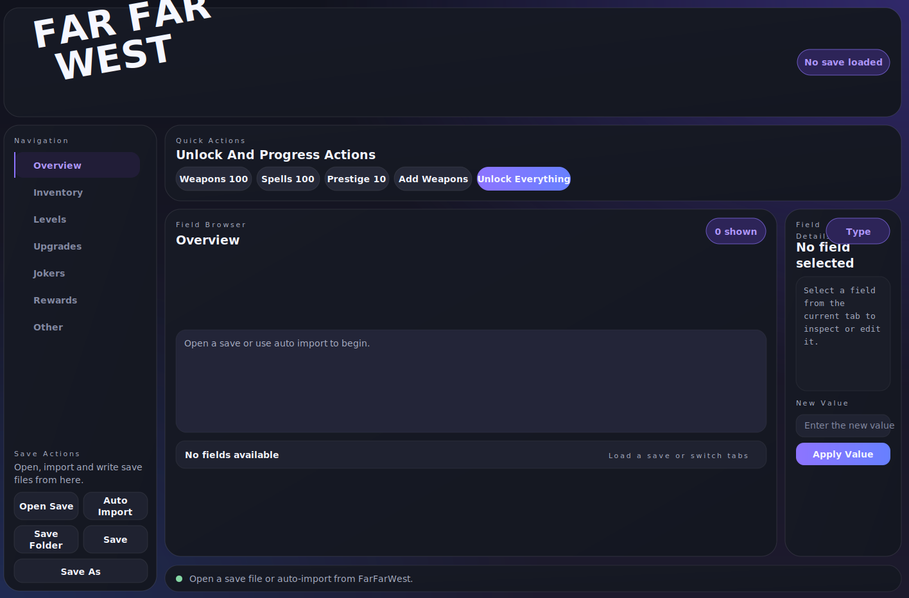

# FarFarWest Unlock Tool

Windows-Tool zum Laden, Bearbeiten und Speichern von **FarFarWest**-Spielständen (`.save`) als portable Desktop-App.  
Du brauchst **kein Python** und keine Konsole: Datei öffnen, Werte anpassen, speichern.

> Die Vorschau zeigt das aktuelle Desktop-Layout der App.

## Was das Programm macht

Das Tool öffnet deinen FarFarWest-Spielstand, entschlüsselt ihn lokal auf deinem PC, zeigt die wichtigsten Werte in einer bearbeitbaren Oberfläche an und speichert den Spielstand danach wieder im richtigen Format zurück.

Damit kannst du zum Beispiel:

- Spielstände direkt aus dem Standardordner laden
- Werte wie Inventar, Level und Upgrades bearbeiten
- Joker- und Reward-Einträge ansehen und anpassen
- mehrere Fortschrittswerte per Schnellaktion sofort setzen
- den bearbeiteten Spielstand wieder als `.save` speichern

## Features

- Portable `.exe` für Windows
- Automatischer Import des neuesten Spielstands aus `%LOCALAPPDATA%\FarFarWest\Saved\SaveGames`
- `Open Save`, `Save` und `Save As`
- Automatische Sicherheitskopie vor dem Überschreiben einer vorhandenen Datei
- Direkte Bearbeitung einzelner Werte in der Oberfläche
- Aufgeräumte Tabs statt Rohdaten oder Hex-Ansicht
- Schnellaktionen für häufige Änderungen

## Schnellaktionen

Im oberen Bereich der App gibt es fertige Aktionen für typische Änderungen:

- `Weapons 100`: setzt Waffen-Level auf 100
- `Spells 100`: setzt Zauber-Level auf 100
- `Prestige 10`: setzt Waffen-Prestige auf 10
- `Add Weapons`: fügt fehlende baubare Waffen zum Inventar hinzu
- `Unlock Everything`: kombiniert mehrere Fortschritts-Änderungen, darunter Waffen, Prestige, Heldenlevel und Währungen

## Oberfläche

Die App ist in drei klare Bereiche aufgeteilt:

### Linke Seite

- Navigation durch die Tabs `Overview`, `Inventory`, `Levels`, `Upgrades`, `Jokers`, `Rewards` und `Other`
- Datei-Aktionen wie `Open Save`, `Auto Import`, `Save Folder`, `Save` und `Save As`

### Mitte

- Liste der Felder aus dem aktuell geöffneten Tab
- schneller Überblick über sichtbare Werte
- je nach Tab z. B. Inventar-Einträge, Levelwerte, Upgrades oder Rewards

### Rechte Seite

- Detailansicht des ausgewählten Felds
- aktueller Wert und Feldtyp
- Eingabefeld für den neuen Wert
- `Apply Value`, um die Änderung zuerst im geladenen Spielstand zu übernehmen

Wichtig: `Apply Value` ändert den geladenen Spielstand in der App.  
Erst mit `Save` oder `Save As` wird die Datei wirklich geschrieben.

## Was in den Tabs bearbeitet werden kann

- `Overview`: allgemeine, wichtige Profilwerte
- `Inventory`: Items und Mengen
- `Levels`: Fortschritts- und Item-Level
- `Upgrades`: Upgrade-Stufen einzelner Waffen oder Einträge
- `Jokers`: Joker-bezogene Werte und Listen
- `Rewards`: gespeicherte Reward-Einträge
- `Other`: weitere editierbare Felder, die nicht in die anderen Bereiche fallen

## Schnellstart

1. Release herunterladen und entpacken.
2. Alle mitgelieferten Dateien zusammen im selben Ordner lassen.
3. `FarFarWest Unlock all tool.exe` starten.
4. Auf `Auto Import` klicken, um den neuesten Spielstand automatisch zu laden.
5. Oder `Open Save` benutzen, um eine bestimmte `.save` auszuwählen.
6. Wert auswählen, rechts anpassen und `Apply Value` klicken.
7. Mit `Save` überschreiben oder mit `Save As` eine Kopie speichern.

Standardordner für Spielstände:

`%LOCALAPPDATA%\FarFarWest\Saved\SaveGames`

## Sicherheit beim Speichern

Wenn du eine bestehende Datei überschreibst, erstellt das Tool zuerst automatisch ein Backup mit Zeitstempel:

`<save-name>.backup_cpp_YYYYMMDD_HHMMSS.save`

Danach wird über eine temporäre Datei gespeichert und erst am Ende die Originaldatei ersetzt. Das reduziert das Risiko einer beschädigten Datei bei einem Abbruch während des Speicherns.

## Hinweise

- Nur für Windows
- Die App funktioniert lokal auf deinem PC
- Die mitgelieferten Dateien neben der `.exe` dürfen nicht fehlen
- Wenn `Auto Import` nichts findet, nutze `Save Folder` oder `Open Save`
- Nach Spiel-Updates kann es sein, dass sich das Save-Format ändert und einzelne Felder angepasst werden müssen

## Für Entwickler

Der Quellcode liegt in diesem Repository und die App wird als native Win32-Anwendung mit WebView2 gebaut. Wer selbst bauen will, findet die Build-Skripte in [build.bat](build.bat) und [package_release.bat](package_release.bat).

Build-Ausgabe:

- `build/FarFarWest Unlock all tool.exe`
- `release/FarFarWest Unlock all tool.zip`
