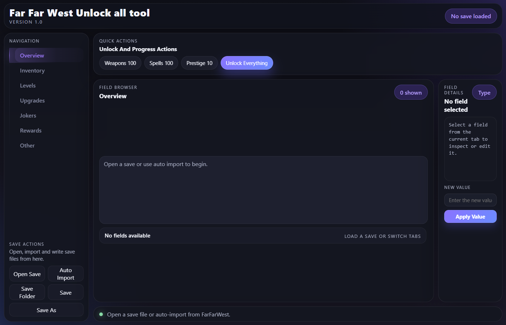
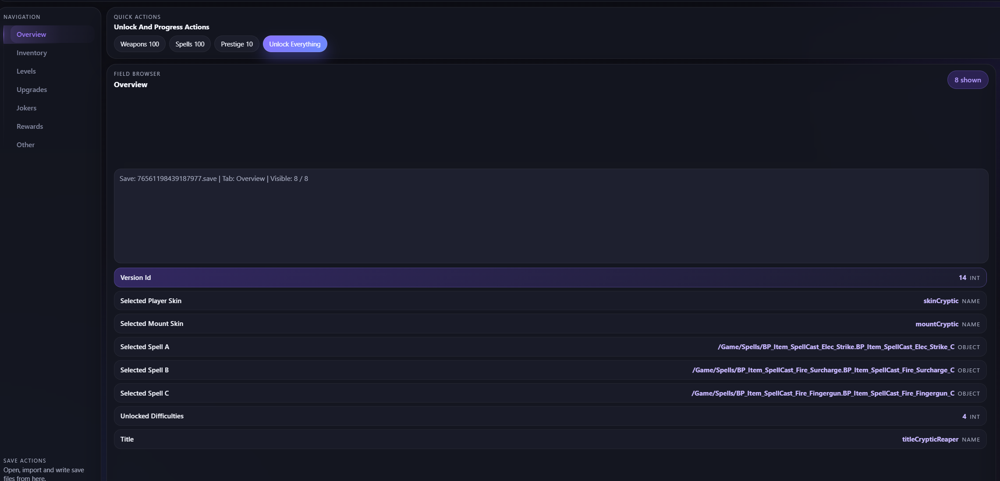
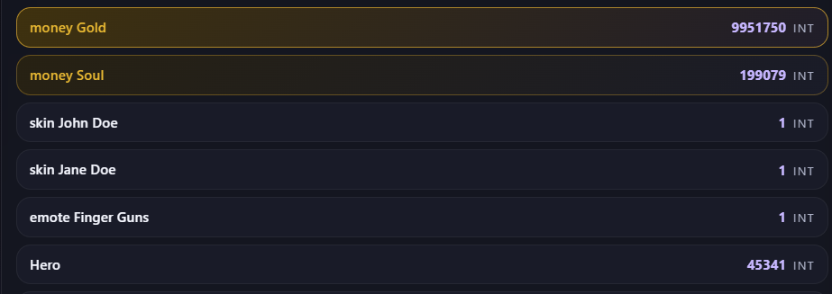

# FarFarWest Unlock all tool

Portable native Windows save editor for **FarFarWest**.

This project rewrites the earlier tool as a standalone desktop app built with Win32 and WebView2, so end users can open, inspect, edit, and save `.save` files without needing a Python installation.






## Highlighted Fields

The most useful fields for the majority of players — like **Gold**, **Souls**, and character **level** — are visually highlighted in the field list so you can find them instantly without scrolling through everything.



## Highlights

- Native Windows `.exe` with a custom WebView2 UI
- AES-256-CBC decrypt/encrypt pipeline for FarFarWest save files
- GVAS parse and serialize support for the property types used by current saves
- Auto import from `%LOCALAPPDATA%\FarFarWest\Saved\SaveGames`
- Timestamped backup creation before overwriting an existing save
- Save and Save As support
- Quick actions for common progression edits
- Dedicated tabs for `Overview`, `Inventory`, `Levels`, `Upgrades`, `Jokers`, `Rewards`, and `Other`

## What You Can Do

The editor is focused on the fields that matter most during normal save editing:

- Browse the loaded save by category instead of digging through raw binary data
- Change scalar values directly from the right-hand editor panel
- Auto-load the latest save from the default FarFarWest save folder
- Apply the built-in one-click actions for `Weapons 100`, `Spells 100`, `Prestige 10`, and `Unlock Everything`

## Quick Start

### For players

1. Download the packaged release.
2. Keep all shipped files in the same folder.
3. Start `FarFarWest Unlock all tool.exe`.
4. Click `Auto Import` to load the newest save automatically, or use `Open Save`.
5. Make your edits.
6. Click `Save` to overwrite the current file, or `Save As` to write a copy.

Default save folder:

`%LOCALAPPDATA%\FarFarWest\Saved\SaveGames`

### Save safety

When you overwrite an existing file, the app first creates a timestamped backup with this pattern:

`<save-name>.backup_cpp_YYYYMMDD_HHMMSS.save`

The write itself goes through a temporary file and then replaces the original save, which reduces the chance of leaving a half-written file behind.


## Notes

- This is a Windows-only desktop application.
- The editor targets the property types currently used by FarFarWest saves. Future game updates may require parser changes.
- The packaged release is portable, but the runtime DLLs and `ui` folder must stay next to the executable.
- If auto import does not find a save, use `Save Folder` or `Open Save`.

## Known Limitations & Research Notes

### Fragments

Adding fragments via the editor should theoretically be possible since they follow the same inventory structure as other items. The raw key format has been confirmed for one entry, and the remaining keys are derived from the same `item<Name>Fragment` pattern:

| Item | Raw key | Status |
|------|---------|--------|
| Utility Heal Bottle Fragment | `itemUtilityHealBottleFragment` | confirmed |
| Utility Ammo Fragment | `itemUtilityAmmoFragment` | inferred |
| Utility Bottle Crate Fragment | `itemUtilityBottleCrateFragment` | inferred |
| Utility Impulse Fragment | `itemUtilityImpulseFragment` | inferred |

Weapon and spell fragments may exist but their keys are currently unknown — the game's pak files are encrypted and fragment items only appear in a save once the player has picked one up in-game.

**Manually adding fragments via the editor causes the game to crash on load, even when the key is correct.** This has been tested with confirmed keys and the result is consistent. Adding fragments is therefore likely not possible through save editing at this time.

If a fragment already exists naturally in your save, you can edit its amount directly from the Inventory tab.

## Building from Source

The project compiles with **clang++** targeting the MinGW-w64 ABI. No Visual Studio or special IDE is required.

### 1. Get LLVM-MinGW

Download the latest `llvm-mingw` release for Windows from GitHub:

**[https://github.com/mstorsjo/llvm-mingw/releases](https://github.com/mstorsjo/llvm-mingw/releases)**

Download the file ending in `-ucrt-x86_64.zip` and extract it. No installer needed.

### 2. Point the build script at it

Either set the `LLVM_MINGW` environment variable to the folder you extracted:

```bat
set LLVM_MINGW=C:\llvm-mingw
build.bat
```

Or simply extract to one of these paths and `build.bat` will find it automatically:

```
C:\llvm-mingw
C:\tools\llvm-mingw
```

If you have [Windhawk](https://windhawk.net/) installed, `build.bat` will also find its bundled compiler automatically as a fallback — no extra steps needed.

### 3. Build

```bat
build.bat
```

Output lands in `build\`. Run `package_release.bat` to produce a distributable ZIP.

### Dependencies

All dependencies are already included in the repository:

- **WebView2** — bundled under `third_party_webview2\` (no download needed)
- **Runtime DLLs** (`libc++.dll`, `libunwind.dll`, `libwinpthread-1.dll`) — copied automatically from your LLVM-MinGW installation into `build\`

End users need the **Microsoft Edge WebView2 Runtime** installed, which is pre-installed on Windows 10 (20H2+) and Windows 11.

## Credits & Acknowledgements

This tool is a rewrite of the original **FarFarWest Save Editor** published on Nexus Mods by its original author:

**[FarFarWest Save Editor (Python) — Nexus Mods](https://www.nexusmods.com/farfarwest/mods/5?tab=description)**

The original tool laid the groundwork for understanding the FarFarWest save format and made this project possible. Without that prior work, none of this would exist. A sincere thank-you goes to the original creator for sharing it with the community.

This C++ rewrite was motivated by two recurring issues with the Python version:

- Many users experienced setup problems installing Python and its dependencies before the tool would even run.
- Several quality-of-life features were missing or impractical to add to the scripted version.

The goal of this rewrite is to give those users a single portable `.exe` that just works, while building on the foundation the original author established.

## Disclaimer

Use the tool on copies or let the built-in backup system keep a recovery point. Editing save data always carries some risk, especially after game updates that change the file format.
